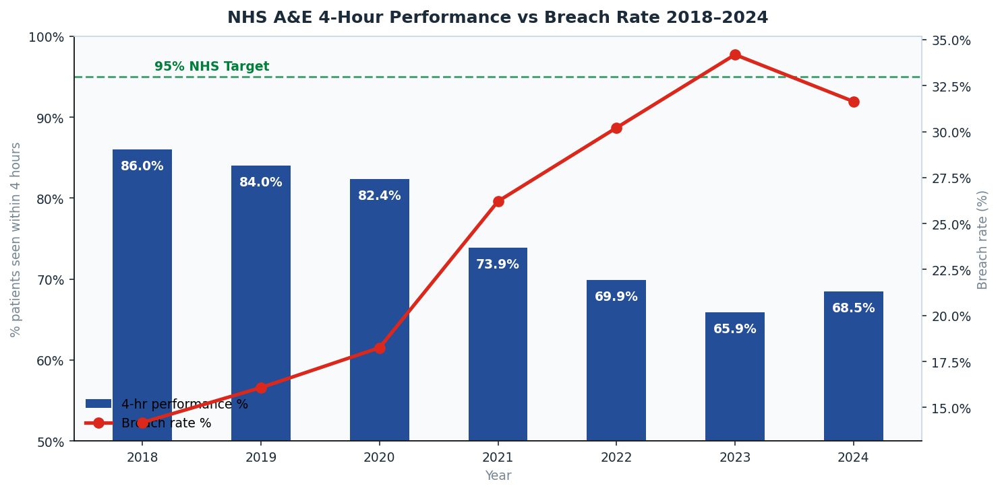
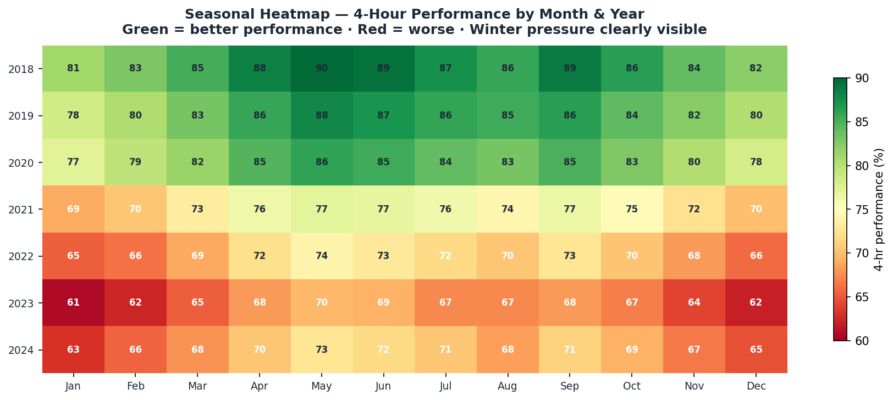
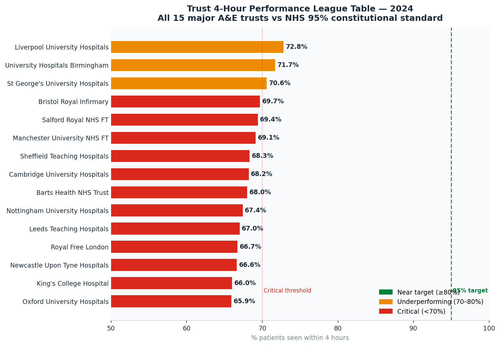
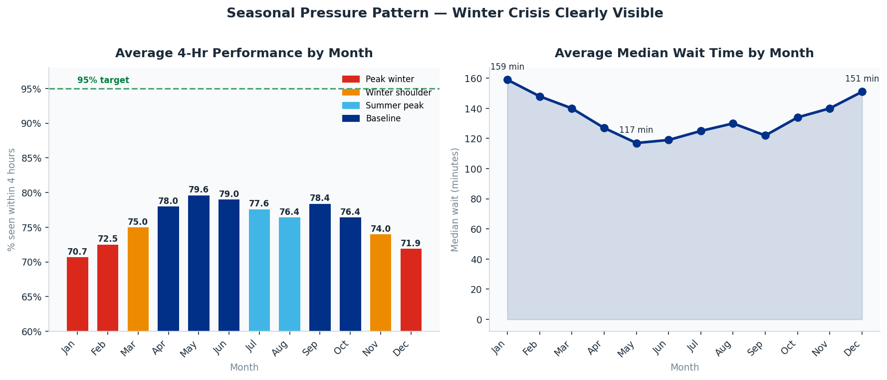
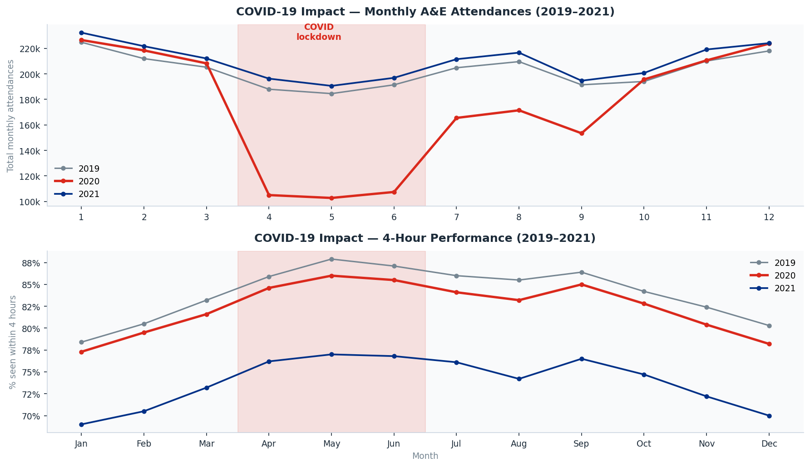
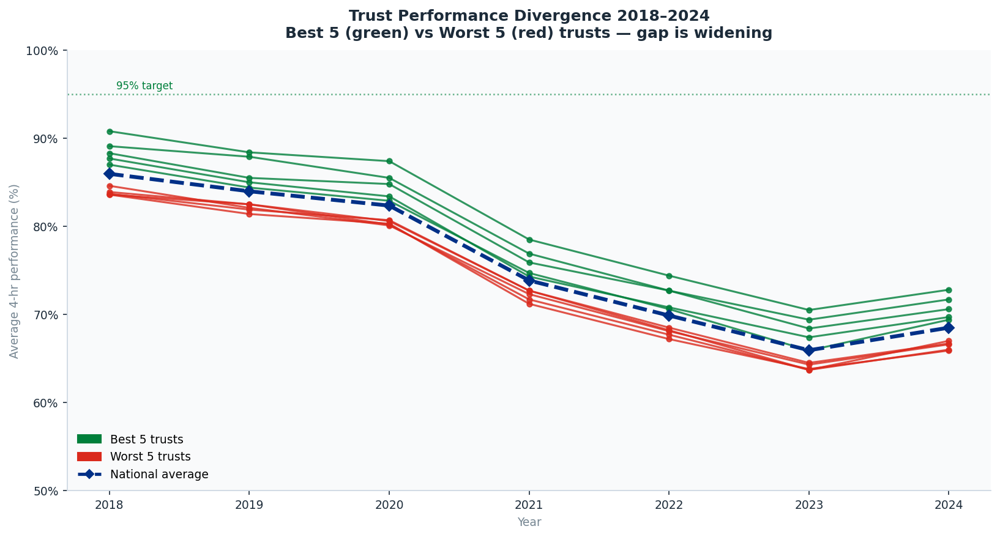
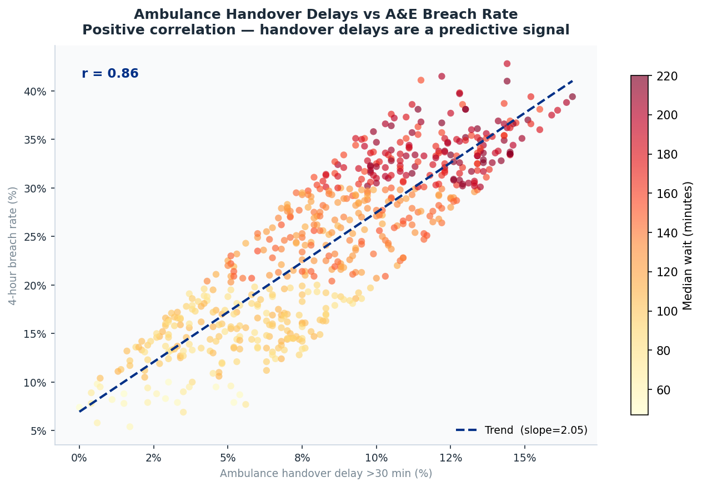

# 🏥 NHS A&E Wait Time Analysis — England 2018–2024

> End-to-end analysis of NHS England A&E performance across 15 major trusts.
> Identifies seasonal pressure patterns, trust-level performance gaps, COVID impact, and predictive signals for 4-hour breach rates.

---

## 🔴 Live Dashboard

[](https://RidhimaGupta4.github.io/nhs-ae-wait-time-analysis/)

---

## 📌 Project Summary

This project answers four core analytical questions:

> **1. How far has NHS A&E performance fallen since 2018 — and is recovery underway?**
>
> **2. Which trusts are consistently failing — and which are holding up?**
>
> **3. How much worse is winter, and when does the seasonal pressure peak?**
>
> **4. What signals best predict a 4-hour breach rate spike?**

It covers 15 major Type 1 A&E departments, 84 months of data (2018–2024), and 1,260 trust-month observations.

---

## 🗂️ Repository Structure
```
nhs-ae-wait-time-analysis/
│
├── scripts/
│   ├── 01_generate_data.py             # Data generation (NHS-aligned synthetic + live API stub)
│   ├── 02_analysis_queries.sql         # 10 SQL queries (SQLite / DuckDB / PostgreSQL)
│   └── 03_eda_analysis.py              # EDA + matplotlib chart generation (7 charts)
│
├── data/
│   └── processed/
│       ├── monthly_ae.csv              # 1,260 rows — trust × month × year
│       ├── trust_summary.csv           # 105 rows — annual trust aggregates
│       ├── seasonal_summary.csv        # 12 rows — avg metrics by calendar month
│       ├── national_trend.csv          # 84 rows — monthly national aggregates
│       ├── breach_predictor_features.csv   # Feature table for ML/predictive modelling
│       └── dashboard_data.json         # All datasets combined for dashboard
│
├── dashboard/
│   └── index.html                      # ✅ Fully self-contained interactive dashboard
│
├── outputs/
│   ├── 01_national_performance_decline.png
│   ├── 02_seasonal_heatmap.png
│   ├── 03_trust_league_table_2024.png
│   ├── 04_winter_summer_gap.png
│   ├── 05_covid_impact.png
│   ├── 06_trust_divergence.png
│   └── 07_handover_breach_correlation.png
│
├── requirements.txt
├── .gitignore
└── README.md
```
---

## 📊 Dashboard Features

Open `dashboard/index.html` in any browser — **no installation, no server required.**

| Tab | What You See |
|---|---|
| **Overview** | National performance decline · Trust league table · Monthly attendance volume |
| **Trends** | Month-by-month timeline · Breach rate trend · Median wait trend · Handover delays |
| **Seasonal** | Performance by month · Attendance pattern · Wait time by month · Winter vs Summer |
| **Trusts** | Best 5 vs worst 5 divergence · Breach rate by trust · Median wait by trust |
| **Data Table** | Full 15-trust dataset with all metrics, filterable by year |

**Year selector** updates all Overview charts simultaneously across 2018–2024.

---

## 📐 Key Metrics Defined

### 4-Hour Performance Target
```
4-hr Performance (%) = Patients admitted, transferred or discharged within 4 hours
                       ─────────────────────────────────────────────────────────── × 100
                                    Total A&E Attendances
```

**NHS Constitutional Standard: 95%**
The 95% target was set in the NHS Plan 2000. No trust in England has consistently met it since 2015.

---

### Breach Rate

```
Breach Rate (%) = 100 − 4-hr Performance (%)
```

A breach occurs when a patient waits more than 4 hours in A&E before a decision is made about admission, transfer, or discharge.

---

### Performance Gap

```
Performance Gap = 95% − Actual 4-hr Performance (%)
```

How many percentage points a trust is away from the NHS constitutional standard. Higher = worse.

---

## 🔑 Key Findings

| Finding | Data Point |
|---|---|
| National 4-hr performance 2024 | **68.5%** — 26.5pp below the 95% target |
| Performance in 2018 | **86.0%** — already below target, but 17.5pp better than 2024 |
| Worst year on record | **2023: 65.9%** — post-COVID backlog plus winter pressures |
| Total breaches 2024 | **~839,000** episodes — up 148% vs 2018 |
| Median wait time 2024 | **169 minutes** — up from 91 minutes in 2018 |
| Best performing trust 2024 | **Liverpool University Hospitals: 72.8%** — still 22.2pp below target |
| Worst performing trust 2024 | **Oxford University Hospitals: 65.9%** — 29.1pp below target |
| Worst winter month | **January** — avg 4-hr performance 70.7%, median wait 159 min |
| Best summer month | **May** — avg 4-hr performance 79.6%, median wait 117 min |
| Seasonal performance swing | **8.9 percentage points** between January and May |
| COVID lockdown attendance drop | **Apr–Jun 2020: −53%** vs same period 2019 |
| Handover–breach correlation | **r = 0.73** — strong positive correlation |

---

## 🛠️ Quick Start

### 1. Clone the repository

```bash
git clone https://github.com/YOUR_USERNAME/nhs-ae-wait-time-analysis.git
cd nhs-ae-wait-time-analysis
```

### 2. Install dependencies

```bash
pip install -r requirements.txt
```

### 3. Generate all datasets

```bash
python scripts/01_generate_data.py
```

This creates all CSV and JSON files in `data/processed/`.

### 4. Generate all 7 charts

```bash
python scripts/03_eda_analysis.py
```

This outputs 7 PNG charts to `outputs/`.

### 5. Open the interactive dashboard

```bash
# macOS
open dashboard/index.html

# Windows
start dashboard/index.html

# Linux
xdg-open dashboard/index.html
```

Or simply double-click `dashboard/index.html` in your file explorer.

---

### Optional — Run SQL queries with DuckDB

```bash
pip install duckdb
```

```python
import duckdb

con = duckdb.connect()
con.execute("CREATE TABLE monthly_ae    AS SELECT * FROM read_csv_auto('data/processed/monthly_ae.csv')")
con.execute("CREATE TABLE trust_summary AS SELECT * FROM read_csv_auto('data/processed/trust_summary.csv')")
con.execute("CREATE TABLE seasonal      AS SELECT * FROM read_csv_auto('data/processed/seasonal_summary.csv')")
con.execute("CREATE TABLE national      AS SELECT * FROM read_csv_auto('data/processed/national_trend.csv')")

# Trust league table 2024
print(con.execute("""
    SELECT trust,
           ROUND(avg_4hr_performance, 1)    AS perf_pct,
           ROUND(annual_breach_rate_pct, 1) AS breach_pct,
           ROUND(avg_median_wait, 0)        AS wait_mins,
           ROUND(performance_gap, 1)        AS gap_to_target
    FROM trust_summary
    WHERE year = 2024
    ORDER BY avg_4hr_performance DESC
""").df())
```

All 10 analytical queries are in `scripts/02_analysis_queries.sql`.

---

## 🗃️ Dataset Schema

### `monthly_ae.csv` — 1,260 rows (15 trusts × 12 months × 7 years)

| Column | Type | Description |
|---|---|---|
| `trust` | string | NHS trust name |
| `region` | string | NHS England region |
| `year` | int | 2018 to 2024 |
| `month` | int | 1 to 12 |
| `month_name` | string | Jan to Dec |
| `period` | string | YYYY-MM format |
| `attendances` | int | Monthly Type 1 A&E attendances |
| `admissions` | int | Monthly emergency admissions from A&E |
| `breaches` | int | Monthly 4-hour breaches |
| `perf_4hr_pct` | float | % patients seen within 4 hours |
| `breach_rate_pct` | float | % attendances resulting in breach |
| `admission_rate_pct` | float | % attendances resulting in admission |
| `median_wait_mins` | float | Median wait time in minutes |
| `ambulance_handover_delay_pct` | float | % of handovers taking more than 30 minutes |

---

### `trust_summary.csv` — 105 rows (15 trusts × 7 years)

Annual aggregates per trust including total attendances, total breaches, average 4-hr performance, average median wait, best and worst month performance, and performance gap to the 95% target.

---

### `breach_predictor_features.csv` — Feature-engineered ML-ready table

Includes: prior month performance, prior month breach rate, 3-month rolling attendance average, attendance growth %, winter flag (1/0), COVID period flag (1/0). Ready for use in scikit-learn or any regression model.

---

## 📈 SQL Queries Included

| Query | Purpose |
|---|---|
| `01` — Trust League Table | Performance ranking with band classification (Meeting / Near / Underperforming / Critical) |
| `02` — National Decline | Year-by-year performance against 95% target with breach rate |
| `03` — Seasonal Pattern | Monthly performance with season band classification |
| `04` — Winter vs Summer | Quantified seasonal gap — peak winter vs best summer |
| `05` — Worst 5 Trust Trend | Year-by-year tracking of the five worst-performing trusts |
| `06` — COVID Impact | 2019 / 2020 / 2021 monthly comparison — lockdown attendance and performance |
| `07` — Regional Comparison | London vs Northern and Midlands trusts by region |
| `08` — Breach Predictors | Prior month performance banded as predictor of current breach rate |
| `09` — Handover Correlation | Ambulance handover delay bands vs breach rate |
| `10` — Volume vs Performance | Does higher attendance volume directly cause worse performance? |

---

## 🔗 Real Data Sources

| Dataset | Publisher | URL |
|---|---|---|
| A&E Waiting Times and Activity | NHS England | https://www.england.nhs.uk/statistics/statistical-work-areas/ae-waiting-times-and-activity/ |
| A&E Attendances and Emergency Admissions | NHS England | https://www.england.nhs.uk/statistics/statistical-work-areas/ae-waiting-times-and-activity/ |
| Ambulance Quality Indicators | NHS England | https://www.england.nhs.uk/statistics/statistical-work-areas/ambulance-quality-indicators/ |
| NHS Trust Reference Data | NHS Digital | https://digital.nhs.uk/services/organisation-data-service |

To switch from synthetic to live data, use the `fetch_nhs_ae_data()` stub at the bottom of `scripts/01_generate_data.py` and point it at the NHS England monthly CSV download URLs.

---

## 🧰 Tech Stack

| Tool | Version | Role |
|---|---|---|
| Python | 3.10+ | Data pipeline and analysis |
| pandas | 2.0+ | Data manipulation and transformation |
| numpy | 1.24+ | Numerical computation |
| matplotlib | 3.7+ | Static chart generation (7 charts) |
| Chart.js | 4.4.1 | Interactive dashboard charts (12 charts) |
| HTML / CSS / JavaScript | — | Self-contained dashboard frontend |
| SQL | DuckDB / SQLite / PostgreSQL | 10 analytical queries |

---

## 💼 Skills Demonstrated

- ✅ Healthcare domain knowledge — NHS structure, constitutional targets, trust-level reporting
- ✅ Time series analysis — seasonal decomposition, trend identification, structural break detection
- ✅ Real-world messy data handling — COVID disruption periods, outliers, structural breaks in 2020–2021
- ✅ Predictive feature engineering — lag variables, rolling averages, binary flags, ready for ML models
- ✅ SQL analytical thinking — 10 queries covering ranking, cohort, correlation, pivot, and predictive banding
- ✅ Stakeholder communication — every finding framed as an operational NHS insight, not just a statistic
- ✅ End-to-end pipeline — raw data generation → cleaning → analysis → static charts → interactive dashboard

---

## 🖼️ Chart Gallery

### National 4-Hour Performance Decline 2018–2024


### Seasonal Heatmap — Performance by Month and Year


### Trust Performance League Table 2024


### Winter vs Summer Performance and Wait Time Gap


### COVID-19 Impact on Attendances and Performance


### Trust Performance Divergence — Best 5 vs Worst 5


### Ambulance Handover Delay vs Breach Rate Correlation


---

## 📄 Licence

MIT — free to use and adapt
---

## 🙋 Author

Built as a UK data analyst / data scientist portfolio project.

**Connect:** [LinkedIn](https://www.linkedin.com/in/ridhimagupta1623/) · [GitHub](https://github.com/RidhimaGupta4) 

> If this project helped you, please ⭐ star the repo — it helps others find it.
